# Mock Web

A modern e-commerce web application built with [Next.js](https://nextjs.org/), TypeScript, and Tailwind CSS.

---

## Prerequisites

- [Node.js](https://nodejs.org/) >= 22.0.0
- [pnpm](https://pnpm.io/) >= 9.0.0
- [Docker](https://www.docker.com/) (for containerised runs)

---

## Running Locally

### 1. Install dependencies

```bash
pnpm install
```

### 2. Configure environment variables

```bash
cp .env.example .env.local
```

Edit `.env.local` and fill in the required values.

### 3. Start the development server

```bash
pnpm dev
```

The app will be available at [http://localhost:3000](http://localhost:3000).

### Other useful commands

| Command | Description |
|---|---|
| `pnpm build` | Build for production |
| `pnpm start` | Start the production server |
| `pnpm lint` | Run ESLint and type checks |
| `pnpm format` | Format code with Prettier |
| `pnpm test` | Run tests once |
| `pnpm test:watch` | Run tests in watch mode |
| `pnpm test:coverage` | Run tests with coverage report |

---

## Running with Docker

### Build the image

```bash
docker buildx build --platform linux/amd64 -t mock-web .
```

> `--platform linux/amd64` is required when building on Apple Silicon (arm64) for deployment to x86_64 hosts (e.g. EKS t3.medium nodes). Omitting it produces an arm64 image that will fail with `no match for platform in manifest: not found`.

### Run the container

```bash
docker run -p 3000:3000 mock-web
```

The app will be available at [http://localhost:3000](http://localhost:3000).

### Pass environment variables

```bash
docker run -p 3000:3000 \
  -e NEXT_PUBLIC_API_URL=https://api.example.com \
  mock-web
```

Or use an env file:

```bash
docker run -p 3000:3000 --env-file .env.local mock-web
```

### Using Docker Compose

```bash
docker compose up --build
```

To run in detached mode:

```bash
docker compose up --build -d
```

To stop:

```bash
docker compose down
```

---

## Project Structure

```
src/
├── app/          # Next.js App Router pages and layouts
├── components/   # Reusable UI components
├── data/         # Static/mock data
├── types/        # TypeScript type definitions
└── test/         # Test setup and utilities
```

---

## Deployment

### Architecture

```mermaid
flowchart LR
    User(["User\nbrowser"])

    subgraph GoDaddy["GoDaddy DNS"]
        CNAME["CNAME\napp-dev.zamait.in"]
    end

    subgraph AWS["AWS (us-east-1)"]
        subgraph APIGW["API Gateway (HTTP API)"]
            Domain["Custom Domain\napp-dev.zamait.in\n*.zamait.in cert"]
            Route["$default route\nHTTP_PROXY"]
        end

        subgraph CDN["CloudFront"]
            CF["Distribution\nE2Q8ZI1O7IZUAL"]
            Fn["CloudFront Function\nURL rewrite / SPA fallback"]
        end

        subgraph Storage["S3 (private)"]
            Bucket["app-dev-us-east-1-*\nStatic export\nOAC-only access"]
        end
    end

    User -->|"https://app-dev.zamait.in"| CNAME
    CNAME -->|"CNAME → d-h2pj5jq35e\n.execute-api.us-east-1.amazonaws.com"| Domain
    Domain --> Route
    Route -->|"HTTP proxy\nhttps://d3v1nayoxs95jk.cloudfront.net"| CF
    CF --> Fn
    Fn -->|"OAC sigv4"| Bucket
```



**Request flow:**
1. Browser resolves `app-dev.zamait.in` via GoDaddy CNAME → API Gateway regional endpoint
2. API Gateway terminates TLS with the `*.zamait.in` imported cert and proxies to CloudFront
3. CloudFront runs a URL-rewrite function (SPA fallback → `index.html`), then fetches from S3
4. S3 serves the static Next.js export — accessible only via CloudFront OAC (sigv4)

---

### Prerequisites

| Tool | Version | Purpose |
|---|---|---|
| [Terraform](https://www.terraform.io/downloads) | >= 1.0 | Provision AWS infrastructure |
| [AWS CLI](https://aws.amazon.com/cli/) | v2 | Upload to S3, invalidate CloudFront |
| [Node.js](https://nodejs.org/) | >= 22 | Build Next.js |
| [pnpm](https://pnpm.io/) | >= 9 | Package manager |

AWS credentials must be configured (`aws configure` or environment variables).

---

### First-time setup

#### 1. Import your SSL certificate into ACM (us-east-1)

The wildcard cert `*.zamait.in` must be in `us-east-1` (required by both CloudFront and API Gateway).

```bash
aws acm import-certificate \
  --region us-east-1 \
  --certificate fileb://certificate.pem \
  --private-key fileb://private-key.pem \
  --certificate-chain fileb://chain.pem
```

#### 2. Configure Terraform variables

```bash
cp terraform/terraform.tfvars.example terraform/terraform.tfvars
```

`terraform/terraform.tfvars`:

```hcl
aws_region         = "us-east-1"
environment        = "dev"
project_name       = "app"
domain_name        = "app-dev.zamait.in"
certificate_domain = "zamait.in"   # primary domain of the imported cert
```

#### 3. Provision infrastructure

```bash
cd terraform
terraform init
terraform apply
```

Resources created: S3 bucket, CloudFront distribution + cache policies + URL-rewrite function, API Gateway HTTP API + custom domain + mapping.

#### 4. Add CNAME in GoDaddy

After `terraform apply` completes, grab the API Gateway target domain:

```bash
terraform output api_gateway_target_domain_name
```

In GoDaddy DNS, add:

| Type | Name | Value | TTL |
|---|---|---|---|
| CNAME | `app-dev` | `<api_gateway_target_domain_name>` | 3600 |

---

### Deploy application

```bash
./deploy.sh
```

The script:
1. Builds the Next.js static export (`out/`)
2. Uploads files to S3 with correct `Cache-Control` headers per asset type
3. Creates a CloudFront invalidation and waits for it to complete

To redeploy without rebuilding:

```bash
./deploy.sh --skip-build
```

---

### Useful commands

```bash
# Show all infrastructure outputs (URLs, IDs, commands)
cd terraform && terraform output

# Manually invalidate CloudFront cache
aws cloudfront create-invalidation \
  --distribution-id E2Q8ZI1O7IZUAL \
  --paths '/*' --region us-east-1

# Sync build output to S3 manually
aws s3 sync ./out s3://$(cd terraform && terraform output -raw s3_bucket_name)/ \
  --delete --region us-east-1

# Tear down all infrastructure
cd terraform && terraform destroy
```

---

### Cache strategy

| Asset type | Cache-Control | Rationale |
|---|---|---|
| `*.html` | `public, max-age=3600, must-revalidate` | 1 hour — content may change |
| `_next/static/**/*.js` | `public, max-age=31536000, immutable` | Hashed filenames — safe to cache forever |
| `_next/static/**/*.css` | `public, max-age=31536000, immutable` | Hashed filenames — safe to cache forever |
| Images / fonts | `public, max-age=86400` | 24 hours |

---

### Troubleshooting

**403 from CloudFront / S3**
- Confirm the S3 bucket policy `AWS:SourceArn` matches the exact CloudFront distribution ARN (wildcards require `StringLike`, not `StringEquals`)
- Check the CloudFront OAC is attached to the distribution origin

**Certificate not found by Terraform**
- Ensure the cert is in `us-east-1` (not another region)
- If the cert uses an EC key algorithm, confirm `key_types = ["EC_prime256v1", ...]` is set in the `aws_acm_certificate` data source — the ACM list API omits non-RSA certs by default

**Custom domain not resolving**
- Verify the GoDaddy CNAME points to the API Gateway target domain (`terraform output api_gateway_target_domain_name`), not the CloudFront domain
- Allow up to 60 minutes for DNS propagation

---

## Tech Stack

- **Framework**: [Next.js 16](https://nextjs.org/)
- **Language**: [TypeScript](https://www.typescriptlang.org/)
- **Styling**: [Tailwind CSS 4](https://tailwindcss.com/)
- **Testing**: [Vitest](https://vitest.dev/) + [Testing Library](https://testing-library.com/)
- **Linting**: [ESLint](https://eslint.org/) + [Prettier](https://prettier.io/)
- **Package Manager**: [pnpm](https://pnpm.io/)

---
